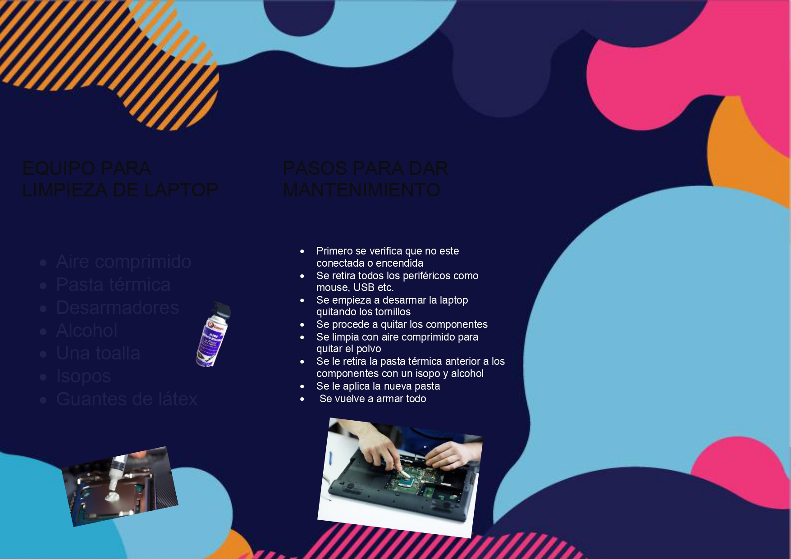

# practica Inicial seccion C                        
 Marvin Perez 201903712

 ## manual de mantenimiento de una computadora 
  
  ### **Introduccion**

las computadoras se han vuelto una parte esencial de nuestras vidas. Ya sea
que las utilicemos para el trabajo, el entretenimiento o la educación, es
fundamental que mantengamos nuestros equipos en buen estado para
garantizar un rendimiento óptimo y prolongar su vida útil existen varios tipos de
mantenimientos 

### **Mantenimiento Preventivo**
El mantenimiento preventivo es una práctica clave para garantizar el
funcionamiento adecuado de una computadora. Consiste en llevar a cabo
tareas periódicas que previenen problemas antes de que ocurran. Algunas
acciones comunes incluyen:

 A)  Limpieza física:  
 La acumulación de polvo y suciedad en los componentes internos puede
afectar el enfriamiento y provocar un rendimiento deficiente. Es importante
limpiar regularmente el teclado, el monitor, los puertos y, especialmente, el
interior de la computadora

B) Actualización de software:  
Mantener el sistema operativo y las aplicaciones actualizadas es fundamental
para protegerse contra vulnerabilidades de seguridad y asegurar el
funcionamiento sin problemas.

### **Mantenimiento Correctivo**
El mantenimiento correctivo se refiere a las acciones que se toman después de
que un problema ya ha ocurrido. Aunque el mantenimiento preventivo ayuda a
reducir la frecuencia de fallas, es difícil evitar problemas en su totalidad.
Algunas medidas de mantenimiento correctivo incluyen:

A) Diagnóstico y resolución de problemas:  
Identificar la causa raíz de un problema y aplicar soluciones adecuadas, como
la reinstalación de controladores o la eliminación de software malicioso.

B) Reemplazo de componentes: 
Si un componente crítico falla, como el disco duro o la memoria RAM, es
necesario reemplazarlo para restaurar el funcionamiento normal.

### **Mantenimiento Predictivo**

El mantenimiento predictivo implica el uso de herramientas y técnicas para
prever cuándo un componente o dispositivo puede fallar. Esto permite tomar
medidas preventivas antes de que ocurran problemas graves. Algunos métodos
de mantenimiento predictivo son:  

A) Monitoreo del rendimiento: 
Utilizar software para supervisar el rendimiento del sistema, la temperatura y el
uso de recursos para detectar señales tempranas de problemas.

B) Análisis S.M.A.R.T:  
Muchos discos duros modernos tienen una tecnología llamada S.M.A.R.T.
(Self-Monitoring, Analysis, and Reporting Technology) que proporciona
información sobre el estado del disco y sus posibles fallos.

### **herramientas y pasos para mantenimiento de una laptop**
Herramientas
1. Destornilladores.
2. Alcohol isopropílico.
3. Pinceles y/o isopos.
4. Pasta térmica.
5. Aire comprimido. 

Pasos para realizar un Mantenimiento Preventivo

Paso 1 Desensamblar: procederemos a desarmar la computadora, primero se
verifica que el equipo se encuentre apagado removeremos los tornillos
necesarios para realizar esto, luego desconectaremos las memorias RAM y
discos duros

Paso 2 Limpieza de componentes: Utilizar aire comprimido para eliminar el
polvo, aplicar alcohol isopropílico con ayuda de isopos para limpiar la suciedad.

Paso 3 Aplicar Pasta Térmica: Emplear pasta térmica sobre el procesador.

Paso 4 Reensamblar: Volvemos a rearmar la computadora.

## **trifoliar**

[Ver el video en YouTube](https://youtu.be/LxWjA_7j39M)

