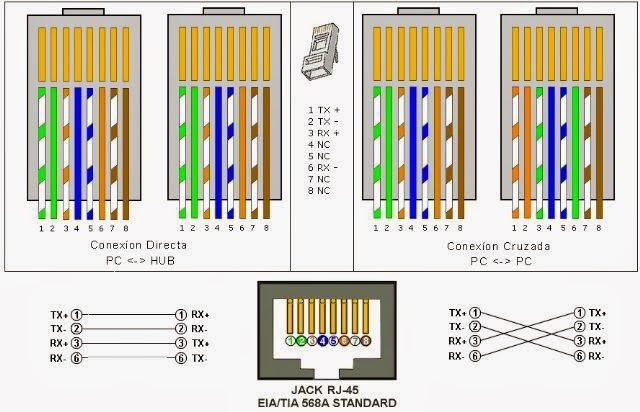

# practica Inicial seccion C                        
 Marvin Perez 201903712

 ## cable de red 

  ### **Introduccion**
   en esta preactica se realizo una maquina virtual con sistema operativo linux para configurar red  y tambien se realizo un cable de red 

   ### **herramientas para realizar cable de red**
Herramientas
1. cable utp
2. conectores rj45
3. ponchadora
4. tester 

video 1 
[Ver el video en YouTube](https://youtu.be/kQwy7uU75kE)

video 2
[Ver el video en YouTube](https://youtu.be/aqRUwutc4ro)